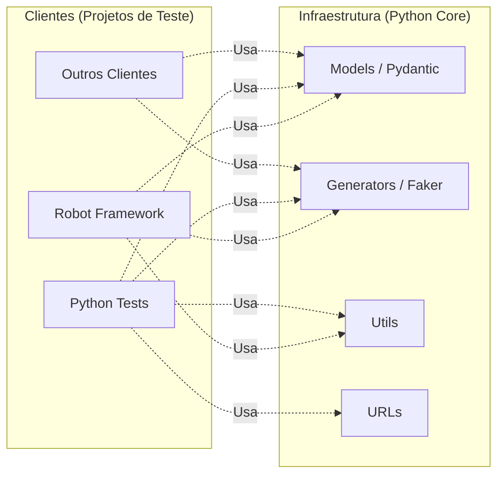

# SDET Python Automation Core 🧠

Este repositório é o "coração" técnico do ecossistema de automação. Ele foi projetado como uma **Shared Library (Biblioteca Compartilhada)** em Python, focada em fornecer infraestrutura de dados, modelos de contrato e utilitários para projetos de teste.

O objetivo principal desta lib é garantir o **DRY (Don't Repeat Yourself)** e a consistência dos contratos de dados em múltiplos clientes de teste. Ao centralizar a lógica de geração de dados e validação de modelos, evitamos duplicação de código e garantimos que todos os projetos de teste utilizem os mesmos contratos validados.

## 🏗️ Arquitetura do Projeto

Diferente de abordagens monolíticas, este projeto atua como uma **biblioteca de infraestrutura**, fornecendo recursos compartilhados (Models, Generators e Helpers) para múltiplos clientes de teste, como o [sdet-robot-automation-project](https://github.com/rftrombeta/sdet-robot-automation-project).

### Fluxo de Integração
Os projetos clientes consomem esta biblioteca para garantir contratos válidos e geração de massa de dados dinâmicas, enquanto focam na orquestração e execução dos testes.



## 📁 Estrutura do Projeto

```
sdet-python-automation-core/
├── src/
│   └── sdet_python_automation_core/    # Pacote principal da biblioteca
│       ├── models/                      # Definições de Schemas (Pydantic Models)
│       │   ├── schemas/                 # Models Pydantic para validação
│       │   │   ├── login_schema.py      # LoginRequest (Pydantic Model)
│       │   │   ├── usuario_schema.py    # UsuarioRequest (Pydantic Model)
│       │   │   └── produto_schema.py    # ProdutoRequest (Pydantic Model)
│       │   ├── login.py                 # Factory para criação de payloads de login
│       │   ├── produtos.py              # Factory para criação de payloads de produto
│       │   └── usuarios.py              # Factory para criação de payloads de usuário
│       ├── generators/                  # Geradores de dados
│       │   ├── generate_cnpj_cpf.py     # Geração de CPF/CNPJ válidos
│       │   ├── generate_date.py         # Geração de datas formatadas
│       │   └── generate_random.py       # Geração de dados aleatórios (UUID, códigos, etc)
│       ├── url/                         # Gerenciamento de URLs
│       │   └── url_api.py               # URLs de API por ambiente
│       └── utils/                       # Helpers e utilitários
│           └── utils.py                 # Funções auxiliares gerais
├── pyproject.toml                       # Configuração de build e dependências
└── README.md                            # Este arquivo
```

## 🛠️ Tecnologias Utilizadas

- **Python 3.9+**: Base tecnológica da biblioteca.
- **Pydantic**: Utilizado para a criação de **Models** que validam os contratos das APIs, garantindo que os dados trafegados estejam corretos conforme PEP 589.
- **Faker**: Integração para geração de massa de dados dinâmicos e aleatórios (e-mails, nomes, senhas) com suporte para localização brasileira (pt_BR).
- **Requests**: Cliente base para futuras abstrações de comunicação HTTP.
- **python-dotenv**: Para gerenciar variáveis de ambiente (.env).
- **Pyproject.toml (PEP 621)**: Gestão de dependências e metadados de forma centralizada e moderna, substituindo o antigo `setup.py`.

## 📋 Pré-requisitos

- Python 3.9 ou superior instalado.
- Git para clonar o repositório.
- pip (geralmente incluído com Python 3.9+).
- Acesso à internet para instalar dependências.

## 🚀 Instalação e Configuração

### Instalação Local (Desenvolvimento)

Para desenvolver ou contribuir com a biblioteca:

1. **Clonar o Repositório**
   ```bash
   git clone https://github.com/rftrombeta/sdet-python-automation-core.git
   cd sdet-python-automation-core
   ```

2. **Configurar Ambiente Virtual (venv)**
   É altamente recomendado o uso de um ambiente isolado:
   ```bash
   # Windows
   python -m venv venv
   .\venv\Scripts\activate

   # Linux/Mac
   python3 -m venv venv
   source venv/bin/activate
   ```

3. **Instalar a Biblioteca em Modo Editável**
   ```bash
   pip install -e .
   ```

   Isso instalará a biblioteca em modo de desenvolvimento, permitindo que mudanças no código sejam refletidas imediatamente.

### Instalação via pip (Produção)

Para usar a biblioteca em seus projetos de teste:

```bash
pip install sdet-python-automation-core
```

Ou adicione ao seu `requirements.txt`:

```
sdet-python-automation-core
```

## 📖 Exemplos de Uso

### Gerando Payloads

A biblioteca fornece funções prontas para gerar payloads padronizados:

```python
from sdet_python_automation_core.models import usuarios, login, produtos

# Gerar payload de usuário
payload_usuario = usuarios.create_payload_usuario()
print(payload_usuario)
# Output: {'nome': 'Maria Silva', 'email': 'maria@example.com', 'password': 'senha123', 'administrador': False}

# Gerar payload de login
payload_login = login.create_payload_login()
print(payload_login)

# Gerar payload de produto
payload_produto = produtos.create_payload_produto()
print(payload_produto)
```

### Gerando Dados Aleatórios

```python
from sdet_python_automation_core.generators.generate_random import (
    generate_identifier_code_random,
    generate_identifier_reference,
    generate_uuid4,
    generate_num_ref
)
from sdet_python_automation_core.generators.generate_cnpj_cpf import (
    generate_cpf,
    generate_cnpj
)
from sdet_python_automation_core.generators.generate_date import (
    generate_current_date,
    generate_date_plus_n_days,
    generate_randon_date
)

# Gerar código identificador de 6 dígitos
codigo = generate_identifier_code_random(6)
print(codigo)  # Output: '123456'

# Gerar referência alfanumérica
referencia = generate_identifier_reference("TEST")
print(referencia)  # Output: 'TEST-1234-ABC'

# Gerar UUID v4
uuid = generate_uuid4()
print(uuid)  # Output: '550e8400-e29b-41d4-a716-446655440000'

# Gerar número de referência
num_ref = generate_num_ref()
print(num_ref)  # Output: '1234567890'

# Gerar CPF válido
cpf = generate_cpf()
print(cpf)  # Output: '12345678901'

# Gerar CNPJ válido
cnpj = generate_cnpj()
print(cnpj)  # Output: '12345678000190'

# Gerar data atual
data_atual = generate_current_date()
print(data_atual)  # Output: '2024-03-15'

# Gerar data futura (+30 dias)
data_futura = generate_date_plus_n_days(30)
print(data_futura)  # Output: '2024-04-14'

# Gerar data aleatória
data_aleatoria = generate_randon_date("yyyy-mm-dd")
print(data_aleatoria)  # Output: '2025-07-23'
```

### Gerenciando URLs de API

```python
from sdet_python_automation_core.url.url_api import get_url_api

# Obter URL da API conforme ambiente
api_url = get_url_api()
print(api_url)  # Output: 'https://serverest.dev/#/'
```

## 🤝 Contribuindo

Contribuições são bem-vindas! Para contribuir com o projeto:

1. Faça um fork do repositório
2. Crie uma branch para sua feature (`git checkout -b feature/nova-funcionalidade`)
3. Faça commit de suas mudanças (`git commit -m 'Adiciona nova funcionalidade'`)
4. Push para a branch (`git push origin feature/nova-funcionalidade`)
5. Abra um Pull Request

### Diretrizes

- Mantenha o código limpo e bem documentado
- Adicione docstrings para novas funções/classes
- Siga o padrão de nomenclatura existente
- Teste suas mudanças antes de submeter o PR

## 👨‍💻 Autor

**Rodrigo Trombeta** - [LinkedIn](https://linkedin.com/in/rodrigotrombeta) | [Portfólio](https://rftrombeta.github.io/)

---

## 📄 Licença

Este projeto está sob licença. Veja o arquivo de licença para mais detalhes.
